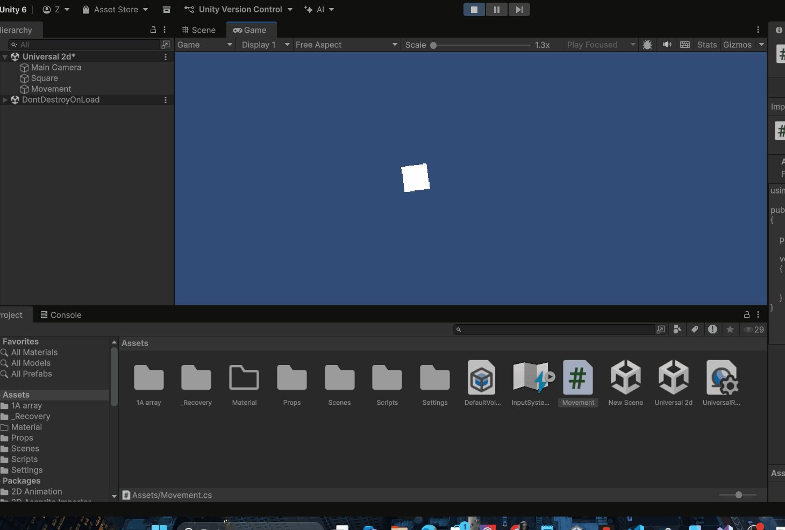
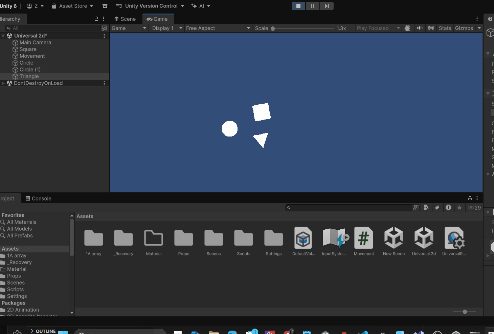

# Coneptschets
Title: Reverse Busters
Genre: Physics-based arcade shootergame
# Beschrijfing
De speler schiet een bal naar de muur. Die muur weerkaatst de bal. Die bal moet proberen om de enemies achter de speler te raken. Elke keer dat je een grote enemy raakt, krijg je 10 punten. bij elke kleine tegenstander krijg je 20 punten. als je 2 tegenstanders raakt, krijg je een double kill en krijg je dubbel de punten (bijvoorbeeld als je 2 kleine tegenstanders raakt krijg je 60 punten inplaats van 20) als ze je pakken, krijg je een game over scherm te zien.
# Gameplaykern
- speler (een canon van de bovenperspectief
- enemy (een groene zombie voor de kleine, en een groen/gele zombie voor de grote)
- de bal (een vuurbal)
- de weerkaatsende muur (een muur dat op en neer gaat)
- achtergrond (gras)
- doel (proberen om zo veen mogelijk zombies neer te schieten)
# Stijl en sweer
cartoon. energieke achtergrond muziek met sound effects voor de zombies
# structuur van het spel
- links (het weerkaatsende muur)
- midden (de speler)
- rechts (de zombies die naar jouw toe lopen)

# 2.1 wat heb ik deze week gedaan?

ik heb deze week gewerkt met AddForce. je kan de bal laten bewegen door op a te kli!
kken. Ik heb ook een OnCollisionEnter toegevoegd, en een ridgit body+collider.

verder had ik geen moeite 

# Opdracht 1A
Hier heb ik een array gemaakt, waneer je op a klikt, krijg je een verschilende Element 


```C#

using UnityEngine;

public class RandomItems : MonoBehaviour
{
    //een lijst(array) maken
    [SerializeField]
    internal string[] fish = new string[9];

    private void Start()
    {
        Debug.Log(fish[2]);
    }
    void iets()
    {
        int boon = Random.Range(0,fish.Length);

        Debug.Log(fish [boon]);
    }
    void Update()
    {
        if (Input.GetKeyUp(KeyCode.A)) {
            iets();
        }

    }
}

```
# SkillGit Unity



# 2.2 Mikken Schieten en LineRenderer

in deze les had ik ervor gezorgd dat je de bal kon schieten via de kanon, en ik heb een line renderer toegevoegd.

Voorbeeld


code voor Schieten en LineRenderer

```C#
using UnityEngine;
public class Shoot : MonoBehaviour
{

    [SerializeField] private float lineSpeed = 10f;
    [SerializeField] private GameObject prefab;
    [SerializeField] private float forceBuild = 20f;
    [SerializeField] private float maximumHoldTime = 5f;

    private LineRenderer _line;
    private bool _lineActive = false;
    private float _pressTimer = 0f;
    private float _launchForce = 0f;

    [SerializeField]private Vector3 offset = new Vector3(3.5f, 0f, 0f);

    private void Start()
    {
        _line = GetComponent<LineRenderer>();
        _line.SetPosition(1, offset);

        


    }


    private void Update()
    {
        HandleShot();
    }
    private void HandleShot()
    {
        //Check of de linkermuisknop word ingedrukt (alleen het eerste moment van indrukken)
        if (Input.GetMouseButtonDown(0))
        {
            _pressTimer = 0; //reset de timer weer op 0. Verderop gaan we de tijd hierin bijhouden hoe lang we de knop hebben ingehouden

        }
        if (Input.GetMouseButtonUp(0))
        {
            /*bepaal de kracht die je bal moet krijgen. hoe langer je de knop hebt vastgehouden hoe meer kracht. Met forcebuild kun je deze kracht tweaken in de inspector. Dit is de kracht per seconde.*/
            _launchForce = _pressTimer * forceBuild;

            /*Instantiate maakt van een prefab een gameonject in je scene.
            Er wordt dus een nieuwe bal in je scene aangemaakt.
            Om nog meer met deze bal te kunnen in ons script slaan we hem op in een variabele
            transform.parent verwijst naar de scene zodat de bal in de scene beland en niet in je kannon */
            GameObject ball = Instantiate(prefab, transform.parent);

            /*geef de bal dezelfde rotatie als het kanon zodat we heb de juiste richting op kunnen schieten.*/
            ball.transform.rotation = transform.rotation;

            /*Geef de Rigidbody van de bal een kracht (_launchForce) naar rechts mee op zijn eigen x-as. Doordat de bal goed geroteerd is gaat hij de goede kant op. ForceMode2D.Impulse zorgt dat alle kracht in 1 keer aan de bal gegeven wordt*/
            ball.GetComponent<Rigidbody2D>().AddForce(ball.transform.right * _launchForce, ForceMode2D.Impulse);

            /*Plaats de bal op dezelfde plek als het kanon zodat deze op die plek in de scene verschijnt*/
            ball.transform.position = transform.position + transform.right * 1.5f;
        }
        /*Om te voorkomen dat we oneindige kracht mee kunnen geven beperken we de tijd die we maximaal bij gaan houden. Deze maximum tijd kunnen we in seconden instellen in de inspector (maximumHoldTime)*/
        if (_pressTimer < maximumHoldTime)
        {
            /*Elk frame tellen we de duur van het frame op bij de verstreken tijd sinds we de knop in hebben gedrukt. Zodra we deze los laten weten we dus hoe lang dit duurde */
            _pressTimer += Time.deltaTime;

            if (Input.GetMouseButtonDown(0))
            {
                _pressTimer = 0f;
                _lineActive = true;
              
            }

            if (Input.GetMouseButtonUp(0))
            {

                //eerdere code....voor nu even overgeslagen


                _lineActive = false;
                _line.SetPosition(1, offset);
            }

            if (_lineActive)
            {
                _line.SetPosition(1, offset + (Vector3.right * _pressTimer * lineSpeed));
                
            }
            
        }
    }


}

```

# 3.1/3.2 score triggers/ Combos, Multiplier, Events

wat heb ik gedaan?
ik heb een score en combo systeem toegevoegd aan de game.
les 3.1 was een soort toevoeging van 3.2 des de reden waarom ik ze samen heb gevoegd


de code die ik ervoor heb gebruikt

Combo System.cs
```c#
using System.Collections.Generic;
using UnityEngine;
public class ComboSystem : MonoBehaviour
{
    private List<string> bumperTags = new List<string>();   //lijst met geraakte tags
    private int scoreMultiplier = 1;
    private void Start()
    {
        BumperHit.onBumperHit += CheckForCombo;             //luisteren naar action event onBumperHit als game start
    }
    private void OnDisable()
    {
        BumperHit.onBumperHit -= CheckForCombo;             //stop met luisteren naar action event onBumperHit als scene herstart of game stopt
    }
    private void CheckForCombo(string tag, int bumperValue)
    {
        bumperTags.Add(tag);                                //tag toevoegen aan lijst
        if (bumperTags.Count > 1)                           //check of er meer dan 1 tag is
        {                                                   //check of de laatste 2 tags gelijk zijn
            if (bumperTags[bumperTags.Count - 2] == bumperTags[bumperTags.Count - 1])
            {
                scoreMultiplier++;                          //verhoog de multiplier
            }
            else                                            //als ze niet gelijk zijn
            {
                scoreMultiplier = 1;                        //reset multiplier
                bumperTags.Clear();                         //leeg de lijst met tags
            }
        }                                                   //voeg score toe aan de ScoreManager
        ScoreManager.Instance.AddScore(bumperValue * scoreMultiplier);

        //print score en multiplier in de console
        Debug.Log($"Score: {ScoreManager.Instance.score} || Multiplier: {scoreMultiplier}X");
    }
}
```
BumperHit.cs
```C#
using System;
using UnityEngine;
public class BumperHit : MonoBehaviour
{
    [SerializeField] private int scoreValue = 100;
    public static event Action<string, int> onBumperHit;
    private void OnCollisionEnter2D(Collision2D collision)
    {
        if (collision.gameObject.CompareTag("Ball"))
        {
            onBumperHit?.Invoke(gameObject.tag, scoreValue);//bericht versturen dat er een bumper geraakt is. De tag en waarde sturen we mee

        }
    }
}
```
Score Manager
```C#
using UnityEngine;

public class ScoreManager : MonoBehaviour
{
    // Singleton
    public static ScoreManager Instance;

    // Totale score
    public int score = 0;


    private void Awake()
    {
        // controleren of er al een ScoreManager bestaat
        if (Instance != null && Instance != this)
        {
            Destroy(gameObject);
            return;
        }

        // dit is nu de enige ScoreManager in de scene
        Instance = this;
    }

    // functie om punten toe te voegen
    public void AddScore(int amount)
    {
        score = score + amount;
        // debug voor testen
        Debug.Log("Score: " + score);
    }
}
```

# 4.1 Level design en UI
